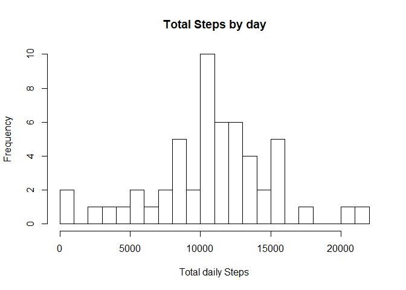
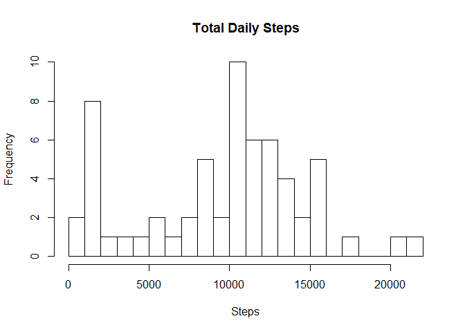
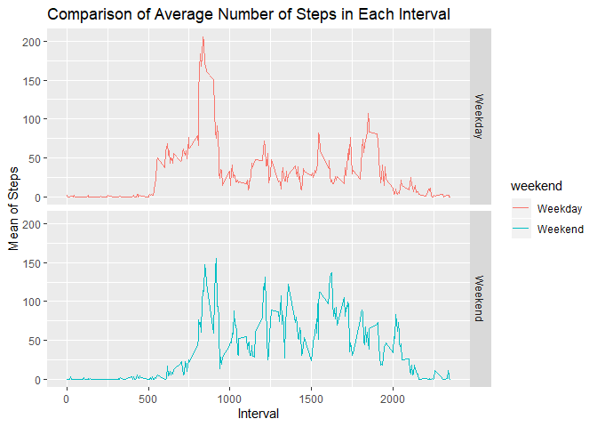

## Baher Anwar R Markdown

This is my first R Markdown document. Markdown is a simple formatting syntax for authoring HTML, PDF, and MS Word documents. For more details on using R Markdown see <http://rmarkdown.rstudio.com>.

Starting reading data  


```r
dt <- read.csv("activity.csv",header = TRUE,sep=",")
head(dt)
```

```
##   steps       date interval
## 1    NA 2012-10-01        0
## 2    NA 2012-10-01        5
## 3    NA 2012-10-01       10
## 4    NA 2012-10-01       15
## 5    NA 2012-10-01       20
## 6    NA 2012-10-01       25
```

```r
library(magrittr)
library(dplyr)
```

```
## 
## Attaching package: 'dplyr'
```

```
## The following objects are masked from 'package:stats':
## 
##     filter, lag
```

```
## The following objects are masked from 'package:base':
## 
##     intersect, setdiff, setequal, union
```

Here we finished reading data  

Now Start to Make a histogram of the total number of steps taken each day  


```r
databydate <- dt %>% select(date, steps) %>% group_by(date) %>% summarize(tsteps= sum(steps)) %>%na.omit()
head(databydate)
```

```
## # A tibble: 6 x 2
##   date       tsteps
##   <fct>       <int>
## 1 2012-10-02    126
## 2 2012-10-03  11352
## 3 2012-10-04  12116
## 4 2012-10-05  13294
## 5 2012-10-06  15420
## 6 2012-10-07  11015
```

```r
hist(databydate$tsteps, xlab = "Total daily Steps",main="Total Steps by day", breaks = 20)
```

<!-- -->

Now we will Calculate and report the mean and median of the total number of steps taken per day


```r
mm <- mean(databydate$tsteps)
md <- median(databydate$tsteps)
```

### The Mean of the total number of steps taken per day is **1.0766189\times 10^{4}**  
### The Median of the total number of steps taken per day is **10765**  

Now What is the average daily activity pattern?


```r
library(ggplot2)
databyinterval <- dt %>% select(interval, steps) %>% na.omit() %>% group_by(interval) %>% summarize(tsteps= mean(steps)) 
ggplot(databyinterval, aes(x=interval, y=tsteps))+ geom_line()
```

<!-- -->

Now Which 5-minute interval, on average across all the days in the dataset, contains the maximum number of steps?


```r
databyinterval[which(databyinterval$tsteps== max(databyinterval$tsteps)),]
```

```
## # A tibble: 1 x 2
##   interval tsteps
##      <int>  <dbl>
## 1      835   206.
```

Here below we will Calculate and report the total number of missing values in the dataset  


```r
missingVals <- sum(is.na(dt))
```

### The total number of rows with NAs **2304**  

Devise a strategy for filling in all of the missing values in the dataset. The strategy does not need to be sophisticated. For example, you could use the mean/median for that day, or the mean for that 5-minute interval, etc.
Here We will use the Median for that 5 -minute interval to replace all the missing values in the dataset.


```r
replacea <- function(x) replace(x, is.na(x), median(x, na.rm = TRUE))
dtm <- dt %>% group_by(interval) %>% mutate(steps= replacea(steps))
head(dtm)
```

```
## # A tibble: 6 x 3
## # Groups:   interval [6]
##   steps date       interval
##   <int> <fct>         <int>
## 1     0 2012-10-01        0
## 2     0 2012-10-01        5
## 3     0 2012-10-01       10
## 4     0 2012-10-01       15
## 5     0 2012-10-01       20
## 6     0 2012-10-01       25
```

Now we will Make a histogram of the total number of steps taken each day and Calculate and report the mean and median total number of steps taken per day.  

Drawing Histogram


```r
FullSummedDataByDay <- aggregate(dtm$steps, by=list(dtm$date), sum)

names(FullSummedDataByDay)[1] ="date"
names(FullSummedDataByDay)[2] ="totalsteps"
head(FullSummedDataByDay,15)
```

```
##          date totalsteps
## 1  2012-10-01       1141
## 2  2012-10-02        126
## 3  2012-10-03      11352
## 4  2012-10-04      12116
## 5  2012-10-05      13294
## 6  2012-10-06      15420
## 7  2012-10-07      11015
## 8  2012-10-08       1141
## 9  2012-10-09      12811
## 10 2012-10-10       9900
## 11 2012-10-11      10304
## 12 2012-10-12      17382
## 13 2012-10-13      12426
## 14 2012-10-14      15098
## 15 2012-10-15      10139
```

```r
hist(FullSummedDataByDay$totalsteps, xlab = "Steps", ylab = "Frequency", main = "Total Daily Steps", breaks = 20)
```

<!-- -->

New Data Mean & Median  


```r
summary(FullSummedDataByDay)
```

```
##          date      totalsteps   
##  2012-10-01: 1   Min.   :   41  
##  2012-10-02: 1   1st Qu.: 6778  
##  2012-10-03: 1   Median :10395  
##  2012-10-04: 1   Mean   : 9504  
##  2012-10-05: 1   3rd Qu.:12811  
##  2012-10-06: 1   Max.   :21194  
##  (Other)   :55
```

Now Do these values differ from the estimates from the first part of the assignment? What is the impact of imputing missing data on the estimates of the total daily number of steps?

Now Showing the mean and median of Old and New data


```r
omean <- mean(databydate$tsteps, na.rm = TRUE)
nmean <- mean(FullSummedDataByDay$totalsteps)

omedian <- median(databydate$tsteps, na.rm = TRUE)
nmedian <- median(FullSummedDataByDay$totalsteps)
```

### Result is  
1- **OLD Mean** is **1.0766189\times 10^{4}** while **NEW Mean** is **9503.8688525**    
2- **OLD Median** is **10765** while NEW Median is **10395**


Are there differences in activity patterns between weekdays and weekends?
Now we will calculate weekdays & weekends

```r
dtm$date <- as.Date(dtm$date)
dtm$weekday <- weekdays(dtm$date)
dtm$weekend <- ifelse(dtm$weekday=="Saturday" | dtm$weekday=="Sunday", "Weekend", "Weekday" )
```

Showing Graph for comparison of Average Number of Steps in Each Interval


```r
meandataweekendweekday <- aggregate(dtm$steps , by= list(dtm$weekend, dtm$interval), na.omit(mean))
names(meandataweekendweekday) <- c("weekend", "interval", "steps")

ggplot(meandataweekendweekday, aes(x=interval, y=steps, color=weekend)) + geom_line()+
facet_grid(weekend ~.) + xlab("Interval") + ylab("Mean of Steps") +
    ggtitle("Comparison of Average Number of Steps in Each Interval")
```

<!-- -->

